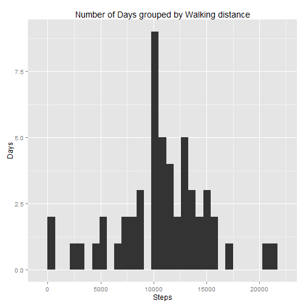
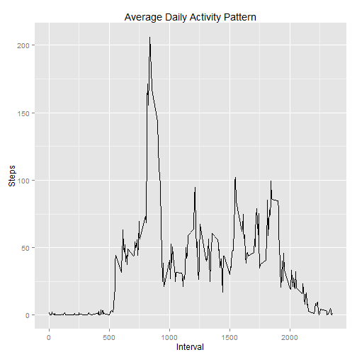
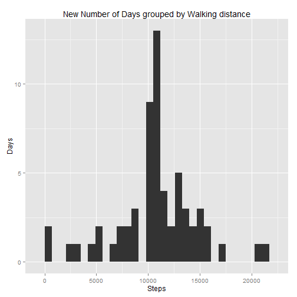
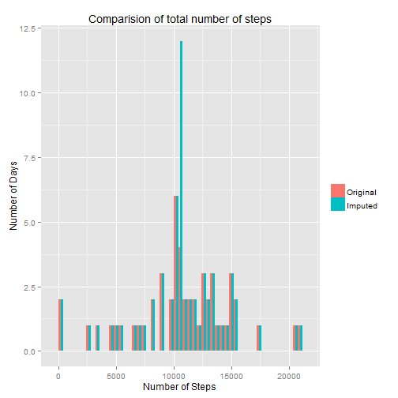
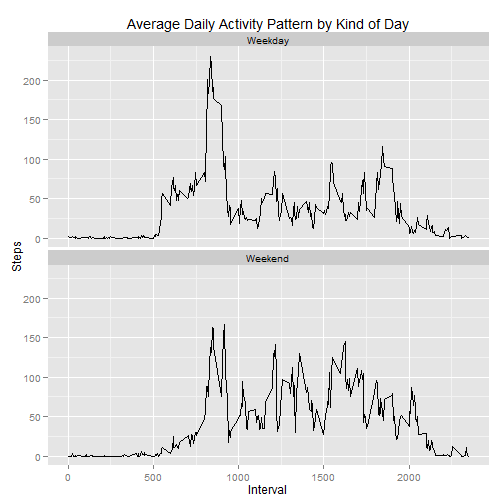

# Reproducible Research: Peer Assessment 1

```r
library(ggplot2)
```

## Loading and preprocessing the data


```r
dt = read.csv("activity.csv")
dt$date = as.Date(dt$date, format="%Y-%m-%d")
```

## What is mean total number of steps taken per day?
### Histogram
Part 1: Make a histogram of the total number of steps taken each day

```r
# for every day, compute the total steps that were taken.
totalStepsPerDay = aggregate(steps ~ date, data=dt, sum)

# Show as histogram
qplot(steps, data=totalStepsPerDay, binwidth = 700) +
  labs(title="Number of Days grouped by Walking distance", x="Steps", y="Days")
```

 

```r
 options(scipen = 50, digits = 5) 
```

Part 2: Calculate and report the mean and median total number of steps taken per day
The Mean number of steps take per day is 10766
The Median number of steps take per day is 10765

## What is the average daily activity pattern?


```r
# Compute average number of steps per interval, e.g. for dt[dt$interval == 0,] it is 0 steps on 2nd, 0 on 3rd, 47 on 4th,...
dtActivityAveragePerInterval <- aggregate(steps ~ interval, data=dt, mean)

qplot(interval, steps, data=dtActivityAveragePerInterval , geom= "line")+  labs(title="Average Daily Activity Pattern", x="Interval", y="Steps")
```

 


## Imputing missing values

There are 17568 missing values.


```r
newdt = dt
# look at all rows where steps == NA and set the value to the average for that interval
act = dtActivityAveragePerInterval # just an alias to stay on 1 line :-) ...
newdt$steps[is.na(dt$steps)] <- sapply(dt$interval[is.na(dt$steps)], function(interval) {act[act$interval == interval,]$steps})


newdt$steps <- unlist(newdt$steps)

newTotalStepsPerDay  = aggregate(steps ~ date, data=newdt, sum)

# Show as histogram
qplot(steps, data=newTotalStepsPerDay, binwidth = 700) +
  labs(title="New Number of Days grouped by Walking distance", x="Steps", y="Days")
```

 

Now the new Mean number of steps take per day is 10766, the value of old-new is 0

The Median number of steps take per day is 10766.18868, the value old-new is -1.18868

There is only a negligable difference in the mean an median from imputing missing values with averages from the rest of the set. This is the case because days with NAs are missing completely from the aggregated set, i.e. the average for the set with NAs ist dominated by the valid values. So, if we replace NAs with those averages, the difference in the average will not be large. That said for means, there is nevertheless a difference, as visible from the following graph:


```r
totalStepsPerDay$type <- as.factor("Original")
newTotalStepsPerDay$type <- as.factor("Imputed")

dtStepHisto <- rbind(totalStepsPerDay, newTotalStepsPerDay)

# Plot histogram
ggplot(dtStepHisto, aes(steps, fill = type))+
  theme(legend.title= element_blank())+
  geom_bar(position= "dodge", binwidth= 400)+
  labs(title="Comparision of total number of steps", x="Number of Steps", y="Number of Days")
```

 


## Are there differences in activity patterns between weekdays and weekends?


```r
# Mapping from day of week to either weekend or sunday

dt = newdt
we <- function(d) if(d %in% c("Sunday","Saturday")) { return( "Weekend") } else {return ("Weekday")}

# Add day variable
dt$wd <- as.factor(weekdays(dt$date)) # weekday
dt$kindOfDay <- as.factor(sapply(dt$wd, we)) # weekend

byKindOfDay = aggregate(dt$steps, by=list(dt$kindOfDay, dt$interval), mean)

names(byKindOfDay) = c("kindOfDay", "interval", "steps")
```


Yes there are differences. As visible form the graph below, Weekday activity is higher. The mean for weekdays is 35.61058 steps, the mean for weekend days is 42.3664 steps


```r
qplot(interval, steps, data=byKindOfDay, geom= "line") +
  facet_wrap(~ kindOfDay, nrow=2)+
  labs(title="Average Daily Activity Pattern by Kind of Day", x="Interval", y="Steps")
```

 

